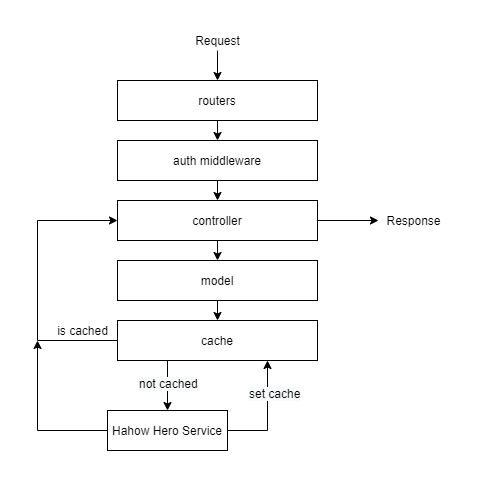

# Hahow Recruit Backend

~https://hahow-recruit-backend.herokuapp.com/~ (Heroku has removed the free plan, and it no longer works!)

## Table of Contents

- [Getting Started](#getting-started)
  - [Install](#install)
  - [Build](#build)
  - [Start API Server](#start-api-server)
- [Getting Started With Docker](#getting-started-with-docker)
  - [Preparation](#preparation)
  - [Start API Server](#start-api-server)
- [Another Scripts](#another-scripts)
  - [End-to-end test](#end-to-end-test)
  - [Eslint](#eslint)
  - [Lint](#lint)
  - [Prettier](#prettier)
  - [Unit test](#unit-test)
  - [Watch](#watch)
- [Architecture](#architecture)
  - [Directory Architecture](#directory-architecture)
  - [Server Architecture](#server-architecture)
- [Third Party Dependencies](#third-party-dependencies)
  - [Dependencies](#dependencies)
  - [Dev dependencies](#devdependencies)
- [註解原則](#註解原則)
- [遇到的困難](#遇到的困難)
- [其他特色](#其他特色)
- [API](#API)

## Getting Started

### Requirement

- Node.js v10 up
- (optional) redis

### Install

```
npm install
```

### Build

```
npm run build
```

### Start API Server

```
npm run start
```

## Another Scripts

### Eslint

```
npm run eslint
```

### Lint

```
npm run lint
```

### Prettier

```
npm run prettier
```

### Unit test

```
npm test
```

### End-to-end test

```
npm run test:e2e
```

### Watch

用於開發, watch 變動的程式碼並重啟

```
npm run watch
```

## Getting Started With Docker

### Requirement

- docker
- docker-compose

### Start API Server

```
docker-compose up
```

## Configuration

```sh
cp .env.example .env
```

In `.env`

```sh
CACHE_DRIVER=redis # Cache 機制, 預設使用 memory 可改指定 redis

# 以下設定為使用 redis 作為 cache 的選項
REDIS_URL=redis
REDIS_PORT=
```

## Architecture

### Directory Architecture

```sh
├── README.md
├── babel.config.js # babel 設定, 讓 Jest 能夠載入 typescript 的檔案
├── build # build 好的程式碼
├── e2e # End-to-end test
├── jest.config.e2e.js # Jest e2e test config
├── jest.config.js # Jest unit test config
├── nodemon.json # nodemon 設定, 可以在有程式碼更動時, 重新載入程式
├── package-lock.json
├── package.json
├── src
|   ├── cache # 快取邏輯
│   │   └── drivers # 不同的 cache 存取方式, 有 Memory, Redis
│   ├── controller # 控制並處理 request
│   ├── middlewares # 存放各種 middleware
│   ├── models # Data 模型
│   ├── routers # Server 的路由
│   └── services # 第三方服務
└── tsconfig.json # typescript 設定
```

### Server Architecture



## Third Party Dependencies

### Dependencies

- axios

  Promise base 的 HTTP client

- dotenv

  載入 .env 檔案, 並轉換成環境變數

- express

  Node.js 的 HTTP server framework, 核心概念是 middleware 的堆疊

- redis

  redis client

- winston

  可擴充的 logger, 可以透過各種 transport 傳送 log, 如 console, file 等等

### Devdependencies

- babel

  Javascript 轉譯工具, 可以將 TypeScript 轉譯成 JavaScript, 或將 JavaScript 新功能轉譯成相容於舊版的 code

  我在此使用是搭配 `@babel/preset-typescript`, 可以讓 Jest 跑 TypeScript 寫的測試

- eslint

  Javascript lint 工具, 能夠找出不良習慣或有問題的程式碼

  我搭配 `@typescript-eslint/eslint-plugin`, `@typescript-eslint/parser` 讓 eslint 能夠 lint TypeScript 程式碼

- jest

  Javascript test framework, 可以輕鬆的建立 mock function 完成測試

- nodemon

  當檔案變動時, 自動重啟 Node.js application 在開發上相當方便

- prettier

  程式碼格式化工具, 可以用在 Javascript, markdown 等等, 統一程式碼風格

- ts-node

  可以不經過編譯直接執行 TypeScript, 用來搭配 nodemon 做為開發用途

- typescript

  具有強型別的 JavaScript 語言, 也具備一些 ECMAScript 的新功能, 是一個 JavaScript 的超集合, 可以使用 tsc 或 babel 轉譯成 JavaScript

## 註解原則

- 當這段程式碼沒辦法一眼看出他的意圖, 就會使用註解解釋這段程式碼的目的
- 在一些會發生特殊事件的情況下做出的處理, 就會留下註解說會發生甚麼狀況, 要做出甚麼處理
- lint 工具的略過檢查註解, 像是在 `controller/error` 錯誤處理中, function 一定要傳入 4 個參數, 即使有些參數用不到, 就會被 lint 報錯, 因此使用註解讓 lint 不檢查

## 遇到的困難

- 這是我第一次使用 TypeScript 從頭建立起專案, 在一開始建立環境時遇到了相當多的困難

  像是 TypeScript 需要先透過轉譯才能再執行, 因此 nodemon 沒辦法直接執行, 參考了 [express-typescript-boilerplate](https://github.com/w3tecch/express-typescript-boilerplate) 的設定

  還有 eslint 與 Jest 也沒辦法直接執行 TypeScript, eslint 參考了 [typescript-eslint](https://github.com/typescript-eslint/typescript-eslint), Jest 則是在官網就有與 TypeScript 搭配的使用方法

- Cache

  Cache 的部分因為 Hahow 提供的 API 變動頻率不大, 所以可以先 cache 住, 降低反應速度, 也降低 Hahow server 的負荷

  但是 Hahow 提供的資料可能是會變動的, 而且沒辦法知道甚麼時候會有變動

  因此在 cache 的時候可能會因為 Hahow 資料的變動而造成使用者所拿到的資料是錯的，目前有想到幾個方法降低拿到錯誤資料的機會

  - 降低 cache expire 時間
  - 拿到 cache 後, 再去向 Hahow 取得資料, 然後更新 cache

  還有可能會遇到一次有多個 request, 並且沒有 cache, 而同時向 Hahow server 發出請求, 造成 Hahow server 的負擔. 這個部分可以使用 lock, 讓同時只能有一個向 Hahow server 的 request.

## 其他特色

- 使用 Github Actions 做 CI, pull request 時, 需要跑過 CI (install, lint, build, unit test, e2e test) 才能 merge
- Merge 到 master 時, 自動 deploy 到 heroku
- 利用 interface, 建立不同的 cache driver, 可以使用不同 cache 的服務, 如 memory, redis

## API

### List Heroes [GET] `/heroes`

**Request**

```bash
curl -H "Accept: application/json" -H "Content-Type: application/json" -X GET https://hahow-recruit-backend.herokuapp.com/heroes
```

**Response 200**

```jsonc
{
  "heroes": [
    {
      "id": "1",
      "name": "Daredevil",
      "image": "http://i.annihil.us/u/prod/marvel/i/mg/6/90/537ba6d49472b/standard_xlarge.jpg"
    },
    {
      "id": "2",
      "name": "Thor",
      "image": "http://x.annihil.us/u/prod/marvel/i/mg/5/a0/537bc7036ab02/standard_xlarge.jpg"
    }
    // ...
  ]
}
```

### Single Hero [GET] `/heroes/:heroId`

**Request**

```bash
curl -H "Accept: application/json" -H "Content-Type: application/json" -X GET https://hahow-recruit-backend.herokuapp.com/heroes/1
```

**Response 200**

```jsonc
{
  "id": "1",
  "name": "Daredevil",
  "image": "http://i.annihil.us/u/prod/marvel/i/mg/6/90/537ba6d49472b/standard_xlarge.jpg"
}
```

**Response 500**

```json
{
  "message": "internal server error"
}
```

### Authenticated List Heroes [GET] `/heroes`

**Request**

```bash
curl -H "Accept: application/json" -H "Content-Type: application/json" -H "Name: hahow" -H "Password: rocks" -X GET https://hahow-recruit-backend.herokuapp.com/heroes
```

**Response 200**

```jsonc
{
  "heroes": [
    {
      "id": "1",
      "name": "Daredevil",
      "image": "http://i.annihil.us/u/prod/marvel/i/mg/6/90/537ba6d49472b/standard_xlarge.jpg",
      "profile": {
        "str": 2,
        "int": 7,
        "agi": 9,
        "luk": 7
      },
    },
    {
      "id": "2",
      "name": "Thor",
      "image": "http://x.annihil.us/u/prod/marvel/i/mg/5/a0/537bc7036ab02/standard_xlarge.jpg"
      "profile": {
        "str": 8,
        "int": 2,
        "agi": 5,
        "luk": 9
      },
    },
    // ...
  ]
}

```

**Response 400**

Bad Request, 提供的驗證資訊不完全

```json
{ "message": "auth validation error" }
```

**Response 401**

Unauthorize, 驗證身分失敗

```json
{ "message": "authentication error" }
```

### Authenticated Single Heroes [GET] `/heroes/:heroId`

**Request**

```bash
curl -H "Accept: application/json" -H "Content-Type: application/json" -H "Name: hahow" -H "Password: rocks" -X GET https://hahow-recruit-backend.herokuapp.com/heroes/1
```

**Response 200**

```jsonc
{
  "id": "1",
  "name": "Daredevil",
  "image": "http://i.annihil.us/u/prod/marvel/i/mg/6/90/537ba6d49472b/standard_xlarge.jpg",
  "profile": {
    "str": 2,
    "int": 7,
    "agi": 9,
    "luk": 7
  }
}
```

**Response 400**

Bad Request, 提供的驗證資訊不完全

```json
{ "message": "auth validation error" }
```

**Response 401**

Unauthorize, 驗證身分失敗

```json
{ "message": "authentication error" }
```

**Response 500**

```json
{
  "message": "internal server error"
}
```
